# Yahoo Finance Extractor

An ETL pipeline that extracts, transforms, and loads financial data from S&P 500 companies using Yahoo Finance API.
The pipeline fetches company tickers from Wikipedia's S&P 500 list and retrieves financial statements via the yfinance library.

## Project Overview

This pipeline extracts financial data for S&P 500 companies from Yahoo Finance, processes and transforms it into a structured format, and outputs the data to CSV files for further analysis. The pipeline is designed to be configurable, reliable, and easy to maintain.

### Links

- **Yahoo Finance**: [Yahoo Finance Website](https://finance.yahoo.com/)
- **yfinance Documentation**: [yfinance PyPI](https://pypi.org/project/yfinance/)
- **S&P 500 List Source**: [Wikipedia S&P 500 Companies](https://en.wikipedia.org/wiki/List_of_S%26P_500_companies)

## Scope

- **Data Extraction**: Retrieves S&P 500 ticker list from Wikipedia and fetches financial statements from Yahoo Finance.
- **Data Transformation**: Processes and structures the raw financial data per company, extracting key financial metrics.
- **Data Loading**: Outputs the processed data to CSV files.

## Features

### Functionalities
- Fetches S&P 500 company tickers from Wikipedia
- Retrieves company metadata (name, country, industry, currency)
- Extracts income statements and balance sheets via yfinance
- Configurable number of companies and fiscal years to process
- Progress tracking with tqdm for long-running operations
- Structured logging for monitoring and debugging

### Tech Stack
- **Python**: Core programming language
- **Pandas**: Data manipulation and transformation
- **Pydantic**: Data validation with structured models
- **yfinance**: Yahoo Finance API wrapper
- **Requests**: HTTP client for Wikipedia scraping
- **tqdm**: Progress tracking for batch processing

## ETL Pipeline Diagram / Workflow

```mermaid
flowchart TD
    subgraph Extract["📥 Extract (extract.py)"]
        A[Wikipedia] -->|get_sp500_tickers| B[S&P 500 Ticker List]
        C[Yahoo Finance API] -->|fetch_all_from_ticker| D[Company Metadata]
        C -->|yfinance| E[Income Statement]
        C -->|yfinance| F[Balance Sheet]
    end

    subgraph Transform["🔄 Transform (transform.py)"]
        D --> G[build_company_records]
        E --> G
        F --> G
        G --> H[CompanyFinancialRecord]
    end

    subgraph Load["📤 Load (main.py)"]
        H --> I[Filter Records]
        I --> J[pandas DataFrame]
        J --> K[company_financials.csv]
    end

    subgraph Models["📋 Models (models.py)"]
        L[CompanyFinancialRecord<br/>Pydantic Model]
    end

    B --> C
    H -.->|validates| L

    style Extract fill:#e1f5fe
    style Transform fill:#fff3e0
    style Load fill:#e8f5e9
    style Models fill:#f3e5f5
```



### ETL Steps

1. **Extract**:
   - Fetch S&P 500 ticker symbols from Wikipedia
   - For each ticker, retrieve company metadata from Yahoo Finance
   - Download annual income statements and balance sheets

2. **Transform**:
   - Parse financial statements for each fiscal year
   - Extract key metrics: revenue, gross profit, operating income, net income, total assets, total liabilities
   - Structure data into validated Pydantic models

3. **Load**:
   - Filter out records without revenue data
   - Convert to pandas DataFrame
   - Save processed data to CSV file

### Folder Structure
```
yahoo_finance_extractor/
├── src/                     # Source code
│   ├── extract.py           # Data extraction from Yahoo Finance
│   ├── transform.py         # Data transformation modules
│   ├── load.py              # Data loading modules
│   ├── models.py            # Pydantic data models
│   └── logger.py            # Logging configuration
├── main.py                  # Main pipeline execution script
├── requirements.txt         # Project dependencies
├── .env.example             # Example environment variables
└── README.md                # Project documentation
```

## Installation & Setup

### Requirements
- Python 3.8 or higher
- Dependencies listed in requirements.txt

### Clone the repo
```bash
git clone https://github.com/reza-abdi7/yahoo_finance_extractor.git
```

### Installation
```bash
pip install -r requirements.txt
```

## Configuration

### Environment Variables
The pipeline uses environment variables for configuration. Copy the example file and set your values:

```bash
cp .env.example .env
```

Then edit `.env` with your desired settings:

| Variable | Description | Example |
|----------|-------------|--------|
| `MAX_COMPANIES` | Maximum number of S&P 500 companies to process | `100` |
| `LATEST_N_YEARS` | Number of fiscal years to retrieve per company | `3` |

## Usage

### Running the ETL Pipeline
To run the complete pipeline:
```bash
python main.py
```

### Output
The pipeline generates `company_financials.csv` containing structured financial data with the following fields:
- `ticker`: Stock symbol
- `company_name`: Company name
- `country`: Headquarters country
- `industry`: Industry classification
- `year`: Fiscal year
- `revenue`: Total revenue
- `currency_unit`: Currency (e.g., USD)
- `gross_profit`: Gross profit
- `operating_income`: Operating income
- `net_income`: Net income
- `total_assets`: Total assets
- `total_liabilities`: Total liabilities

